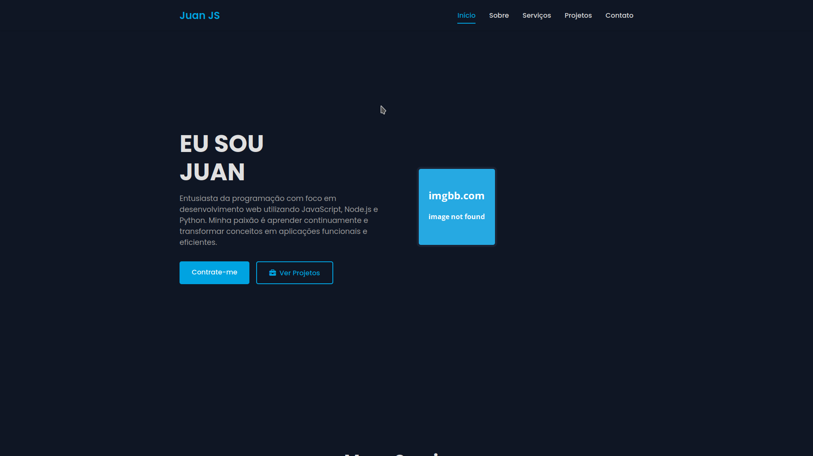

# Portfólio Juan JS


Projeto de portfólio desenvolvido para um cliente, com foco em **experiência responsiva**, **design moderno** e **interatividade**.

---

## 🌟 Funcionalidades

- Menu mobile com toggle e fechamento automático ao clicar fora
- Layout totalmente responsivo para dispositivos móveis e desktop
- Seções animadas ao rolar a página usando **ScrollReveal**
- Seções incluídas:
  - Início
  - Sobre
  - Serviços
  - Projetos
  - Contato

---

## 💻 Tecnologias Utilizadas

- **HTML5**
- **CSS3**
- **JavaScript (ES6+)**
- [ScrollReveal.js](https://scrollrevealjs.org/)
- [Font Awesome](https://fontawesome.com/)

---

## 🚀 Demonstração

Se possível, adicione um screenshot ou GIF do site funcionando:




---

## 📂 Como Usar

1. Clone o repositório:
   ```bash
  git clone https://github.com/Wilki205/Portifolio_Juan.git

